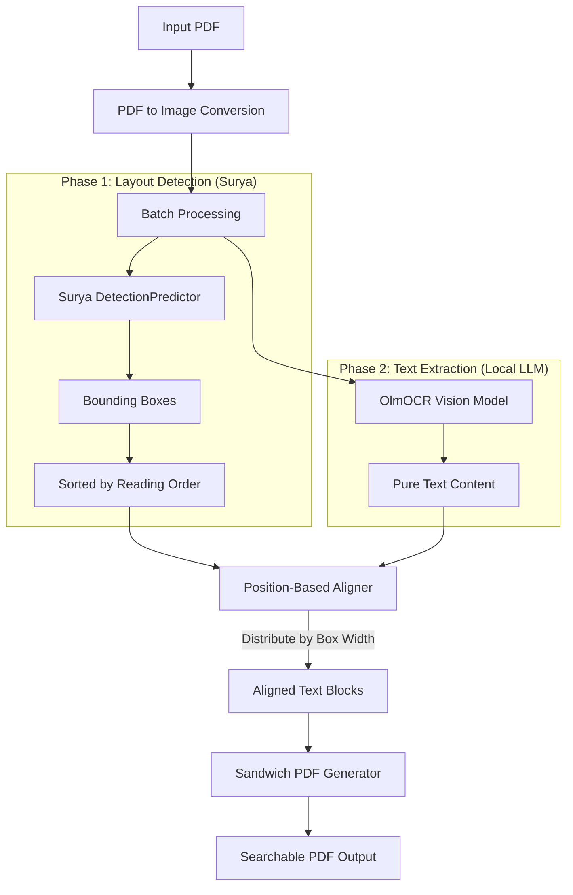

# 📄 Local LLM PDF OCR

[](https://python.org)
[](https://fastapi.tiangolo.com)
[](LICENSE)
[](https://lmstudio.ai)

> **Transform scanned and written documents into fully searchable, selectable PDFs using the power of Local LLM Vision.**

**PDF LLM OCR** is a next-generation OCR tool that moves beyond traditional Tesseract-based scanning. By leveraging OCR Vision Language Models (VLMs) like `olmOCR` running locally on your machine, it "reads" documents with human-like understanding while keeping 100% of your data private.

---

## ✨ Features

-   **🧠 AI-Powered Vision**: Uses advanced VLMs to transcribe text with high accuracy, even on complex layouts or noisy scans.
-   **🤝 Hybrid Alignment Strategy**: Combines **Surya OCR Detection** for precise bounding boxes with **Local LLM** for perfect text content via position-based alignment.
-   **⚡ 10-21x Faster Detection**: Uses detection-only mode (skips slow recognition) and batch processing for maximum speed.
-   **🔒 100% Local & Private**: No cloud APIs, no subscription fees. Run it entirely offline using [LM Studio](https://lmstudio.ai).
-   **🔍 Searchable Outputs**: Embeds an invisible text layer directly into your PDF, making it compatible with valid PDF readers for searching (Ctrl+F) and selecting.
-   **🖥️ Dual Interfaces**:
    -   **Web UI**: An interface with Drag & Drop, Dark Mode, and Real-time progress tracking.
    -   **CLI**: A robust command-line tool for power users and batch automation, featuring a "lively" terminal UI.
-   **⚡ Real-time Feedback**: Watch your document process page-by-page with live web sockets or animated terminal bars.

---

## 🏗️ Architecture



### How It Works

1. **Batch Layout Detection**: Surya's `DetectionPredictor` processes all pages at once, extracting bounding boxes without slow text recognition (~1s total vs ~20s per page with recognition).

2. **LLM Text Extraction**: A local vision model (OlmOCR) reads each page with human-like understanding, handling handwriting and complex layouts perfectly.

3. **Position-Based Alignment**: The aligner distributes LLM text across detected boxes proportionally by box width in reading order—no fuzzy matching needed.

4. **Sandwich PDF**: The original page is rendered as an image with invisible, searchable text overlaid using PyMuPDF.

---

## 🚀 Getting Started

### Prerequisites

1.  **Python 3.10+**
2.  **LM Studio**: Download and install [LM Studio](https://lmstudio.ai).
    -   Load a Vision Model (highly recommended: `allenai/olmocr-2-7b`).
    -   Start the Local Server at default port `1234`.

### Configuration

Create a `.env` file in the root directory to configure your Local LLM:

```env
LLM_API_BASE=http://localhost:1234/v1
LLM_MODEL=allenai/olmocr-2-7b
```

### Installation

This project is managed with [`uv`](https://github.com/astral-sh/uv) for lightning-fast dependency management.

1.  **Install `uv`** (if not installed):

    ```bash
    pip install uv
    ```

2.  **Clone the repository**:

    ```bash
    git clone https://github.com/ahnafnafee/pdf-ocr-llm.git
    cd pdf-ocr-llm
    ```

3.  **Sync Dependencies**:
    ```bash
    uv sync
    ```

---

## Usage

### 1. 🌐 Web Interface (Recommended)

The easiest way to use the tool. Features a modern dashboard with Dark Mode and Text Preview.

1.  **Start the Server**:
    ```bash
    uv run uvicorn server:app --reload --port 8000
    ```
2.  Open your browser to `http://localhost:8000`.
3.  **Drag & Drop** your PDF.
4.  Watch the magic happen! ✨
    -   **Real-time Progress**: Track per-page OCR status.
    -   **Preview**: Click "View Text" to inspect the raw AI extraction.
    -   **Dark Mode**: Toggle the moon icon for a sleek dark theme.

### 2. 💻 Command Line Interface (CLI)

Perfect for developers or integrating into scripts.

Run the OCR tool on any PDF:

```bash
uv run main.py input.pdf output_ocr.pdf
```

**Options**:

-   `-v`, `--verbose`: Enable debug logging (shows alignment details, box counts, etc.)

**Example**:

```bash
uv run main.py contract_scan.pdf contract_searchable.pdf -v
```

_You'll see beautiful animated progress bars showing batch detection and per-page LLM processing._

---

## 🛠️ Tech Stack

-   **Backend**: FastAPI (Async Web Framework)
-   **Frontend**: Vanilla JS + CSS Variables
-   **PDF Processing**: PyMuPDF (Fitz)
-   **Layout Detection**: Surya OCR (Detection-only mode)
-   **AI Integration**: OpenAI Client (compatible with Local LLM servers)
-   **CLI UI**: Rich (Terminal formatting)

---

## ⚡ Performance

| Document Type | Detection Time | Speedup vs Recognition |
| ------------- | -------------- | ---------------------- |
| Digital PDF   | ~1s            | **21x faster**         |
| Handwritten   | ~1s            | **10x faster**         |
| Hybrid Form   | ~1s            | **11x faster**         |

_Detection uses batch processing—all pages in one call._

---

## 🤝 Contributing

Contributions are welcome! Please feel free to submit a Pull Request.

**License**: MIT
